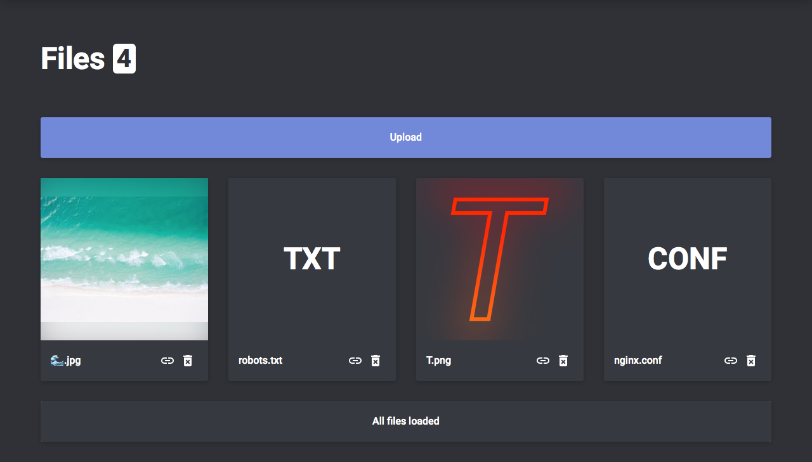

# Debris

Discord-based file storage built with Express and Vue.

## Design

### Header
</img>
Always present at the top of the screen, it is used for app navigation and control.  
It is composed of the following components:

#### Application name
The Debris name on the left side.

#### User button
The button representing the currently logged in user. Clicking on it opens the user menu.

#### User menu
User controls, such as the theme switcher or the logout button.

### Files view
</img>
Within it integrated is the files managament interface, displayed to logged in users at `/`.  
It is composed of the following components:

#### Upload card
The distinctive file input allowing for instant, hassle-free uploading. Additionally it communicates upload errors.

#### File cards
The responsive grid presenting files uploaded by the logged in user so far.  
Supported format image, audio, and video files can be previewed using HTML5 media elements.  

Individual file cards change appearance to communicate the current state of their files, e.g. a progress bar is shown when the file is being uploaded or the card becomes red when the file is being deleted.

High performance and low bandwith usage are key for user experience, so measures are taken to ensure those qualities.  
At first only the 12 most recently uploaded files are shown, with more loaded on request.  
Image previews use scaled-down thumbnails instead of original files, additionally WebP in browsers supporting that format.  
Audio and video previews only preload metadata.  

#### Status card
The dynamic load more button also showing if loading is in progress and how much of the whole library is currently shown. Additionally it communicates loading errors.

## Image processing

Processing with [Sharp](https://www.npmjs.com/package/sharp) is available for JPEG, PNG, WebP and TIFF images.  
While this feature's primary purpose is enabling optimized image previews, it can be used freely.  
The following Sharp options are available through Debris as GET query parameters:  

* [`width`](http://sharp.pixelplumbing.com/en/stable/api-resize/#resize)  
  valid any integer `> 0`  
  default keep  

* [`height`](http://sharp.pixelplumbing.com/en/stable/api-resize/#resize)  
  valid any integer `> 0`  
  default keep  

* [`fit`](http://sharp.pixelplumbing.com/en/stable/api-resize/#resize)  
  only applies if `width` or `height` provided  
  valid `cover`, `contain`, `fill`, `inside` or `outside`  
  default `inside`  

* [`format`](http://sharp.pixelplumbing.com/en/stable/api-output/#jpeg)  
  valid `jpeg`, `png`, `webp` or `tiff`  
  default keep  

* [`quality`](http://sharp.pixelplumbing.com/en/stable/api-output/#jpeg)  
  only applies if `format` is provided and `jpeg`, `webp` or `tiff` or if image already is JPEG, WebP or TIFF  
  valid any integer `>= 5` and `<= 100`  
  default keep or 80 if `format` is provided and `jpeg`, `webp` or `tiff`  

Note that while images can be resized, they cannot be enlarged, due to balooning file sizes.  

##### Example file path with processing parameters: `/files/587605115746123786/ABC.png?height=720&format=jpeg&quality=70`  

## How to run

To run Debris on your own you are going to need the following packages installed in your system:

* Node.js
* npm
* MySQL

You are also going to need a Discord app and a bot attached to it – create them in the [Discord Developer Portal](https://discordapp.com/developers/applications/).

With that out of the way, download (or clone with Git) Debris onto your disk and `cd` into that directory.

Copy `.env.sample` and rename it to `.env`, then fill that `.env` with proper values according to descriptions. If you'd like to fall back to an optional setting's default value, remove the line containing it entirely.

Remember to set up your MySQL server so that it is accessible by Debris. Use `CREATE DATABASE {DEBRIS_MYSQL_DATABASE specified in .env}` as Debris isn't able to take care of that by itself.

Run `$ npm install` to install neccessary npm packages.

That's it! Now just run `$ npm start` to start Debris.

## License

The code of this project is licensed under [GPLv3](LICENSE).
